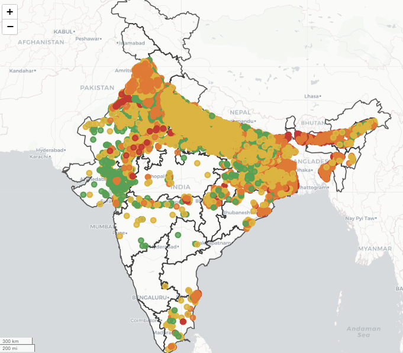
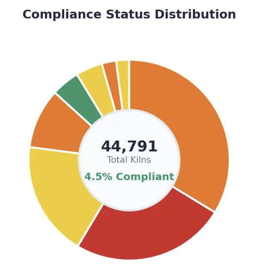
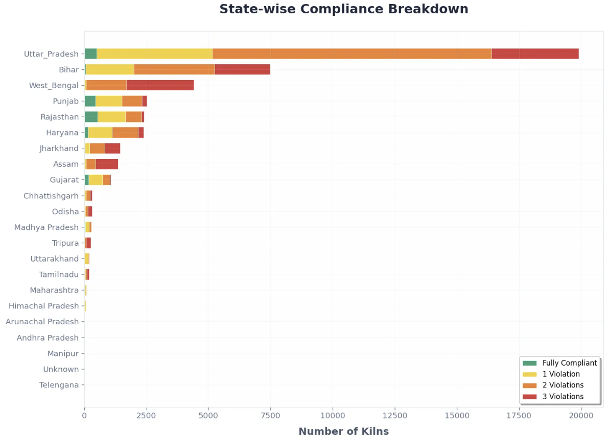

# Enhanced Brick Kiln Compliance Monitoring

Air pollution causes around 7 million deaths annually, with the brick kiln sector contributing significantly, accounting for 8–14% of air pollution in India. While brick kilns are vital to economic development, their largely unregulated and informal nature makes monitoring compliance challenging.

This compliance dashboard offers a streamlined solution to monitor brick kiln adherence to environmental regulations using machine-learning-based detection from satellite imagery. It visualizes compliance status via interactive maps, charts, and detailed reports, aligning with government policies to aid enforcement and policymaking.

By consolidating complex spatial and regulatory data into an accessible platform, the dashboard supports stakeholders in reducing pollution impacts while balancing the livelihoods of workers involved in this sector.

## Features

- Load multiple CSV datasets including brick kilns, hospitals, and waterways.
- Assign kilns to states using GeoJSON state boundaries.
- Compute compliance violations based on configurable distance thresholds.
- Visualize detailed compliance status with interactive maps, pie charts, scatter plots, and bar charts.
- Generate detailed state-wise summaries and downloadable datasets.
- Flexible user interface built with Gradio for ease of use.

## Project Structure

In future releases, the project directory will include the following folders:

```bash
data/ # This folder will contain all CSV files such as kilns, hospitals, waterways, etc.
india_shapefiles/ # This folder will contain GeoJSON files for Indian state boundaries
```

- Place all CSV datasets required for the application inside the **data/** folder.
- Place all GeoJSON files representing Indian states inside the **india_shapefiles/** folder.

The application will be updated to automatically detect and use files from these folders.


## Installation

Make sure Python 3.8 or above is installed.

Install required dependencies:

```bash
pip install -r requirements.txt
```

## Usage

Run the application with:

```bash
python app.py
```
Use the interactive Gradio web dashboard to upload data files, adjust compliance thresholds, and view results.

## Data Sources and Input Format

### Data Sources

The current version uses source data primarily from:

- **OpenStreetMap (OSM):**  
  A collaborative, community-driven initiative providing detailed geographic data contributed worldwide. Using the Geofabrik platform, geometry data for railway tracks, highways, rivers, schools, and habitations was extracted with filters applied as listed below (Table 1). These spatial features support the distance-based compliance monitoring in the app.

  | Dataset                          | Feature           | Filter                                     |
  |---------------------------------|-------------------|--------------------------------------------|
  | gis_osm_landuse_a_free_1.shp    | Habitation        | `fclass = "residential"`                    |
  |                                 | Orchards          | `fclass = "orchard"`                        |
  |                                 | Nature reserves   | `fclass = "nature_reserve"`                 |
  | gis_osm_buildings_a_free_1.shp  | Schools           | `type = "school"`                           |
  |                                 | Hospitals         | `type = "hospital"`                         |
  |                                 | Religious places  | `type = "temple" or "mosque" or "church"` |
  | gis_osm_roads_free_1.shp         | National & Express Highways | `ref starts with "NH" or "NE"`    |
  |                                 | State Highways    | `ref starts with "SH"`                      |
  |                                 | District Highways | `ref starts with "MDR"`                     |
  | gis_osm_water_a_free_1.shp       | Wetland           | `fclass = "wetland"`                        |
  | gis_osm_waterways_free_1.shp     | Rivers            | `fclass = "river"`                          |
  | gis_osm_railways_free_1.shp      | Railway tracks    | No filter                                  |

- **Government Data:**  
  Geolocation data for approximately 165,000 hospitals and nursing homes was obtained from the Indian Government’s open data portal:  
  
  Government of India, data.gov.in. *NIN health facilities geo code and additional parameters*. Retrieved November 26, 2024 from  
  [https://www.data.gov.in/resource/nin-health-faclities-geo-code-and-additional-parameters-updated-till-last-month](https://www.data.gov.in/resource/nin-health-faclities-geo-code-and-additional-parameters-updated-till-last-month)


- **Brick Kiln Dataset:**  
  The SentinelKilnDB is a large-scale dataset and benchmark for oriented bounding box (OBB) brick kiln detection in South Asia using satellite imagery. It is described in the paper:  
  
  Mondal, R., Parab, J., Kubadia, H., Dubey, S., Junagade, S., Patel, Z. B., & Batra, N. (2025).  
  *SentinelKilnDB: A Large-Scale Dataset and Benchmark for OBB Brick Kiln Detection in South Asia Using Satellite Imagery.* Advances in Neural Information Processing Systems.  
  
  The dataset can be used as input to this application and is available on Kaggle at:  
  [https://www.kaggle.com/datasets/3eb8e7201b14b158ed841718cb777c5b94a6a6375aaa8499c7376ec831f8d879](https://www.kaggle.com/datasets/3eb8e7201b14b158ed841718cb777c5b94a6a6375aaa8499c7376ec831f8d879)


### Input CSV Format

- **Kilns CSV:**  
  Must include at least these columns:
  - `lat`: Latitude in WGS84 coordinate system (decimal degrees)
  - `lon`: Longitude in WGS84 coordinate system (decimal degrees)  
  Additional columns such as kiln identifiers or attributes can be included.

- **Hospitals CSV:**  
  Expected columns:
  - `Latitude` and `Longitude` OR `lat` and `lon` (decimal degrees)  
  This data is optional but improves compliance distance checks.

- **Waterways CSV:**  
  Should contain points with columns:
  - `lat` and `lon` (decimal degrees) OR  
  - A `geometry` column containing WKT representations of LineString or MultiLineString features.  
  Waterways data supports compliance checks based on proximity to water bodies.

- **State Boundaries:**  
  Drop GeoJSON files representing state boundaries into a specified folder. The app will automatically load and use these for assigning kilns to states.

## Upcoming Enhancements

- UI/UX improvements for a more intuitive and responsive dashboard.
- Upload functionality enhancements for seamless data input.
- Additional visualization and export options.

## Screenshots

<!-- Add dashboard screenshots below -->

  
This interactive map visually displays the geographic locations of brick kilns classified as compliant or non-compliant based on government environmental regulations. Users can zoom and pan to explore kiln distribution patterns across regions. The map helps identify clusters of non-compliant kilns for targeted policy enforcement and monitoring efforts.

  
The pie chart provides a clear breakdown of the compliance status of all detected brick kilns. It shows the proportion of fully compliant kilns versus those with one or more policy violations. This visual summary enables quick assessment of compliance levels and highlights the extent of regulatory adherence in the monitored area.

  
This bar chart reports detailed compliance statistics for individual states, showing the counts of kilns categorized by violation type or compliance category. It serves as a comparative tool for policymakers and stakeholders to track progress at the state level and prioritize interventions where violations are most prevalent.

## Contact

There is much more to the site than it seems, check it out!

For any issues or questions, please contact Jeet Parab.

## References

- Mondal, R., Parab, J., Kubadia, H., Dubey, S., Junagade, S., Patel, Z. B., & Batra, N. (2025).  
  *SentinelKilnDB: A Large-Scale Dataset and Benchmark for OBB Brick Kiln Detection in South Asia Using Satellite Imagery.*  
  Advances in Neural Information Processing Systems.  
  [Dataset on Kaggle](https://www.kaggle.com/datasets/3eb8e7201b14b158ed841718cb777c5b94a6a6375aaa8499c7376ec831f8d879)

- **Government Data:**  
  Government of India, data.gov.in. *NIN health facilities geo code and additional parameters*. Retrieved November 26, 2024 from  
  [https://www.data.gov.in/resource/nin-health-faclities-geo-code-and-additional-parameters-updated-till-last-month](https://www.data.gov.in/resource/nin-health-faclities-geo-code-and-additional-parameters-updated-till-last-month)

- **Space to Policy:**  
  Sharma, A., Liu, Y., & Chandrasekaran, S. (2025). Space to Policy: Sustainable Policies for Satellite Utilization.  
  *Proceedings of the 2025 ACM Conference on Sustainability and Policy*, 1-10.  
  https://doi.org/10.1145/3736649
